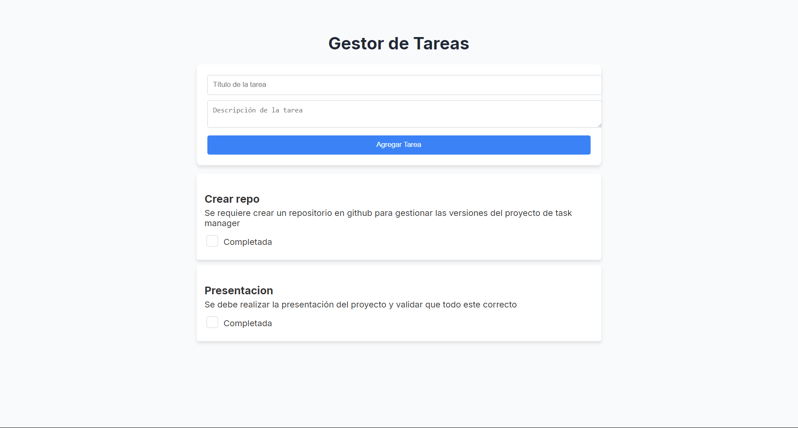
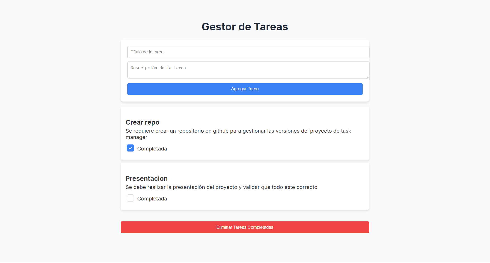

# Gestor de Tareas con React + TypeScript + Vite

Este proyecto es una aplicación de gestión de tareas construida con React, TypeScript y Vite. La aplicación permite a los usuarios agregar, completar y eliminar tareas.

## Instalación

Sigue estos pasos para instalar y ejecutar el proyecto en tu entorno local:

1. Clona el repositorio:
   ```sh
   git clone https://github.com/JhonnSantiagoBernalJuradoCampus/TaskManager-ui.git
   ```
2. Navega al directorio del proyecto:
   ```sh
   cd TaskManager-ui
   ```
3. Instala las dependencias:
   ```sh
   npm install
   ```
# Scripts Disponibles

En el archivo `package.json`, se definen varios scripts que puedes usar para interactuar con el proyecto:

- **`npm run dev`**: Inicia el servidor de desarrollo. Esto iniciará un servidor de desarrollo en el puerto 3000 y actualizará automáticamente el código cuando se hagan cambios en los archivos.

# Estructura del Proyecto

El proyecto tiene la siguiente estructura de directorios:

```
.gitignore
eslint.config.js
index.html
package.json
public/
README.md
src/
    assets/
    components/
        TaskForm.tsx
        TaskList.tsx
        TaskManager.tsx
    index.css
    main.tsx
    vite-env.d.ts
tailwind.config.js
tsconfig.app.json
tsconfig.json
tsconfig.node.json
vite.config.ts
```

# Componentes Principales

- **TaskForm**: `TaskForm.tsx`  
  Permite a los usuarios agregar nuevas tareas proporcionando un título y una descripción.

- **TaskList**: `TaskList.tsx`  
  Muestra la lista de tareas y permite a los usuarios marcar tareas como completadas y eliminar tareas completadas.

- **TaskManager**: `TaskManager.tsx`  
  Gestiona el estado de las tareas y maneja la lógica para agregar, completar y eliminar tareas. Se comunica con un backend para persistir los cambios.

# Estilos

Los estilos de la aplicación están definidos en `index.css` y se utilizan clases de **Tailwind CSS** para el diseño.

# Funcionalidades Principales

- **Agregar Tarea**: Los usuarios pueden agregar una nueva tarea proporcionando un título y una descripción en el formulario de tareas.  
- **Completar Tarea**: Los usuarios pueden marcar una tarea como completada utilizando una casilla de verificación.  
- **Eliminar Tareas Completadas**: Los usuarios pueden eliminar todas las tareas que han sido marcadas como completadas.

# Ver tareas


# Tareas completadas y elimina
En el caso de completar una tarea, aparece un boton para eliminar las tareas completadas.
